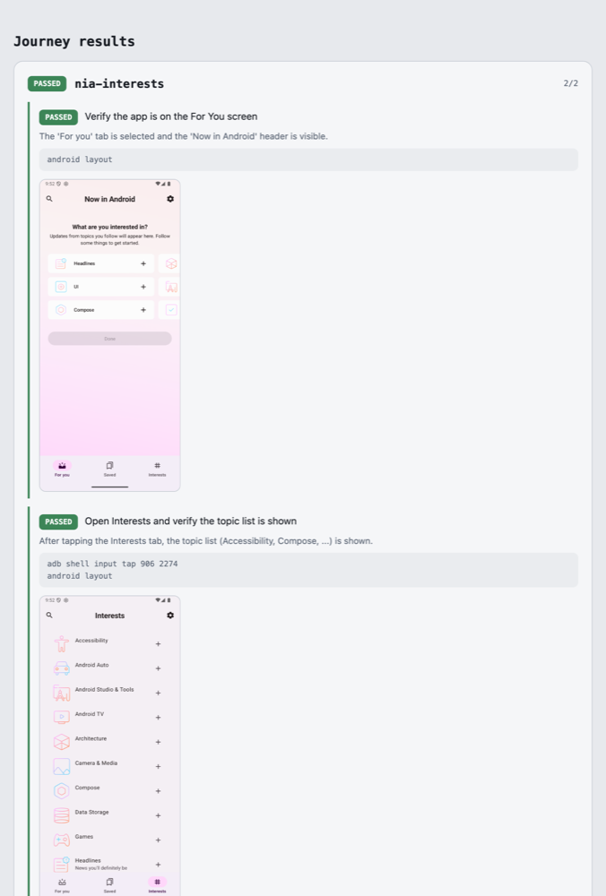

# Journeys Test

*[English](README.md) | 한국어*

Journey를 당신의 CLI 에이전트로 기기에서 실행하고, 결과를 표준 JUnit/Gradle 테스트 리포트로 받는 Gradle 플러그인.

## Journey란?

Journey는 앱의 사용자 흐름을 자연어로 적은 end-to-end 테스트다. 코드 대신 "검색 아이콘을 누른다", "결과 목록이 보이는지 확인한다" 같은 스텝을 XML로 나열하면, 에이전트가 기기에서 그대로 수행하고 각 스텝의 성공 여부를 판정한다. Android Studio가 Gemini로 제공하는 기능이며, 자세한 소개는 공식 문서 [Journeys for Android Studio](https://developer.android.com/studio/gemini/journeys)를 참고한다.

journey 파일은 Android Studio와 같은 위치, 즉 모듈의 `src/journeysTest/` 아래에 `*.journey.xml`로 둔다.

```
app/src/journeysTest/search.journey.xml
```

```xml
<journey name="search">
  <description>검색으로 항목을 찾는다</description>
  <actions>
    <action>Tap the search icon</action>
    <action>Type "compose" into the search field</action>
    <action>Verify a result list is shown</action>
  </actions>
</journey>
```

Android Studio는 이 journey를 Google 백엔드로 실행한다. 이 플러그인은 실행 주체만 당신이 고른 에이전트로 바꾼다. Google Cloud 인증이나 특정 백엔드 없이 원하는 모델을 쓰며, 폴더와 확장자, 태스크 이름(`journeysTest`)이 Studio와 같아 같은 파일을 양쪽에서 그대로 공유한다.

## 설정

플러그인을 적용하고, 사용할 에이전트 CLI만 지정하면 된다. journey를 수행하는 프롬프트는 플러그인에 내장돼 있어(Android Studio Journeys와 같은 방식으로 각 action을 순서대로 수행하고 check/verify는 현재 화면만 검사하며 스텝마다 PASSED/FAILED를 판정한다), 플러그인이 이 명령 뒤에 알아서 덧붙인다.

```kotlin
// build.gradle.kts
plugins { id("io.github.fornewid.journeys-test") version "0.1.0" }

journeys {
    agentCommand.set("claude --no-session-persistence --allowedTools 'Bash(android *)' 'Bash(adb *)' -p")
}
```

헤드리스 모드를 지원하는 에이전트면 무엇이든 쓸 수 있고, 이 값만 바꾸면 된다.

- Claude Code: `claude --no-session-persistence --allowedTools 'Bash(android *)' 'Bash(adb *)' -p`
- Codex: `codex exec --ephemeral --sandbox workspace-write -c 'sandbox_workspace_write.network_access=true'`
- Antigravity: `agy --dangerously-skip-permissions --print-timeout 20m -p`

세 예시 모두 프롬프트를 받는 플래그로 끝난다. 앞 옵션이 프롬프트를 삼키지 않게 하기 위해서다. 기기를 조작할 권한도 함께 준다. Antigravity의 `--print-timeout`은 기본이 5분이니 `timeoutSeconds`보다 크게 잡는다. 그러지 않으면 플러그인보다 에이전트가 먼저 포기해 verdict가 출력되지 않는다.

내장 프롬프트를 직접 바꾸고 싶으면 `prompt`로 덮어쓴다. 그 안의 `{journey}`가 journey 파일의 절대경로로 치환된다.

## 실행

```bash
./gradlew journeysTest
```

결과물은 두 가지다.

- `build/journey-results/*.xml`: 표준 JUnit XML 포맷. CI 테스트 리포터에 이 경로를 지정하면 수집된다.
- `build/journeys/report.html`: 스텝별 결과 뷰(아래 참고).

## 에이전트 계약

플러그인은 판정 로직을 갖지 않는다. 실제 판단은 `agentCommand`가 가리키는 에이전트가 한다(Claude Code, Gemini CLI 등 모델 무관). 에이전트는 기기를 구동한 뒤 결과를 아래 JSON으로 만들어 `<<<VERDICT>>>`와 `<<<END>>>` 마커 사이에 출력하면 된다.

```json
{"journey":"...","results":[{"action":"...","status":"PASSED","reasoning":"...","artifacts":["shots/01.png"]}]}
```

## 초안 만들기

첫 초안을 직접 쓰는 대신, 방금 바꾼 것에 대한 journey를 에이전트가 제안하게 할 수 있다.

```bash
./gradlew journeysDraft                            # 워킹 트리 변경분 기준
./gradlew journeysDraft --since=main               # 특정 ref와의 diff 기준
./gradlew journeysDraft --about="검색 필터"          # 코드가 아직 없을 때
./gradlew journeysDraft --explore                  # 화면마다 스모크 journey 하나씩
```

초안은 `src/journeysTest`가 아니라 `build/journeys/drafts`에 쌓인다. 그래서 `journeysTest`가 실수로 주워가는 일이 없고, 검토하지 않은 초안이 CI까지 흘러가지 않는다. 검토한 뒤 승격한다.

```bash
./gradlew journeysDraftList                        # 대기 중인 초안과 마지막 실행 결과
./gradlew journeysTest --drafts                    # 초안을 그 자리에서 실행
./gradlew journeysDraftPromote --draft=login       # 하나를 src/journeysTest로 옮김
```

초안은 제품의 의도를 모르고도 관찰할 수 있는 것만 단정한다 — 화면이 열린다, 요소가 있다, 크래시하거나 멈추지 않는다. 비즈니스 규칙이나 계산값, 정렬 순서는 승격하는 사람이 채운다. 이 구분은 의도적이다. 초안은 제품의 의도를 모르고도 관찰할 수 있는 것만 단정한다 — 화면이 열린다, 요소가 있다, 크래시하거나 멈추지 않는다. 비즈니스 규칙이나 계산값, 정렬 순서는 승격하는 사람이 채운다. 이 구분은 의도적이다. 자동 탐색이 세울 수 있는 것은 암묵적 오라클뿐이라, 기능적 정확성을 단정하는 초안은 추측이 된다.

journey는 기기를 독점해야 한다. 멀티모듈 빌드에서는 Gradle이 두 에이전트를 동시에 돌려 서로의 앱을 조작하게 되므로, `journeysTest`와 `journeysDraft`는 빌드 전역 잠금을 잡고 하나씩 실행된다. 이 잠금은 Gradle 호출 하나의 범위이니, 같은 기기를 두 빌드에서 동시에 조작하지 않는다. 기기는 한 대를 전제한다. 여러 대가 붙어 있으면 에이전트에 `ANDROID_SERIAL`을 지정한다.

## 샘플

Android 에뮬레이터를 실행하거나 기기를 연결한 뒤, 오프라인 단일 Compose 샘플을 실행한다.

```bash
./gradlew :sample:journeysTest
```

태스크가 샘플 APK를 빌드·설치하고 Claude Code가 온보딩부터 기사 상세까지 journey를 수행한다.
`-PjourneyAgentCommand=...`으로 에이전트를 바꿀 수 있으며 Claude 명령은 `sample/README.md`에 있다.

## 결과 뷰

`journeysTest`를 돌리면 `build/journeys/report.html`이 함께 만들어진다. 스텝마다 성공/실패와, 에이전트가 스크린샷을 남겼다면 그 화면을 브라우저에서 한눈에 볼 수 있다.


